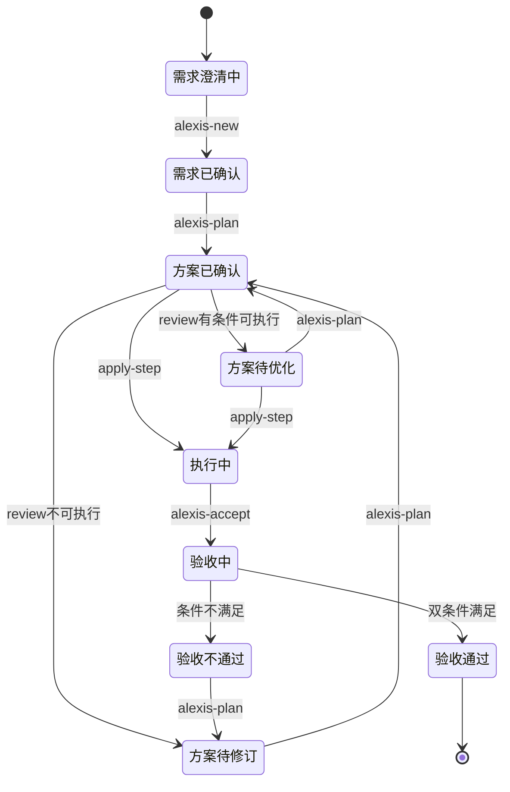

# 状态定义与转换

## 需求状态（meta.json.status）

| 状态 | 含义 | 可转换到 |
|------|------|----------|
| 需求澄清中 | alexis-new 提问阶段 | 需求已确认 |
| 需求已确认 | 用户确认需求简报 | 方案已确认 |
| 方案已确认 | alexis-plan 完成 | 方案待修订, 执行中 |
| 方案待修订 | review 发现问题 | 方案已确认 |
| 方案待优化 | review 有条件可执行 | 方案已确认, 执行中 |
| 执行中 | apply-step 进行中 | 验收中 |
| 验收中 | alexis-accept 执行 | 验收通过, 验收不通过 |
| 验收通过 | 流程结束 | - |
| 验收不通过 | 需重规划 | 方案待修订 |

---

## 状态转换图

---

## 状态转换触发

| 当前状态 | 触发指令 | 目标状态 | 条件 |
|----------|----------|----------|------|
| 需求澄清中 | alexis-new | 需求已确认 | 用户确认需求简报 |
| 需求已确认 | alexis-plan | 方案已确认 | 用户确认执行方案 |
| 方案已确认 | alexis-review | 方案待修订 | 结论=不可执行 |
| 方案已确认 | alexis-review | 方案待优化 | 结论=有条件可执行 |
| 方案已确认 | alexis-apply-step | 执行中 | 首次执行Task |
| 方案待修订 | alexis-plan | 方案已确认 | 用户确认修订方案 |
| 方案待优化 | alexis-plan | 方案已确认 | 用户确认优化方案 |
| 方案待优化 | alexis-apply-step | 执行中 | 首次执行Task |
| 执行中 | alexis-accept | 验收中 | 开始验收 |
| 验收中 | alexis-accept | 验收通过 | 双条件满足 |
| 验收中 | alexis-accept | 验收不通过 | 任一条件不满足 |
| 验收不通过 | alexis-plan | 方案待修订 | 开始重规划 |

---

## Task状态（execution.md）

| 状态 | 含义 | 可转换到 |
|------|------|----------|
| todo | 待执行 | in_progress |
| in_progress | 执行中 | done, blocked |
| done | 已完成 | - |
| blocked | 被阻塞 | in_progress |

**禁止使用 skipped**：若Task不执行，必须修订 design.md 并在 plan_review.md 记录原因。
